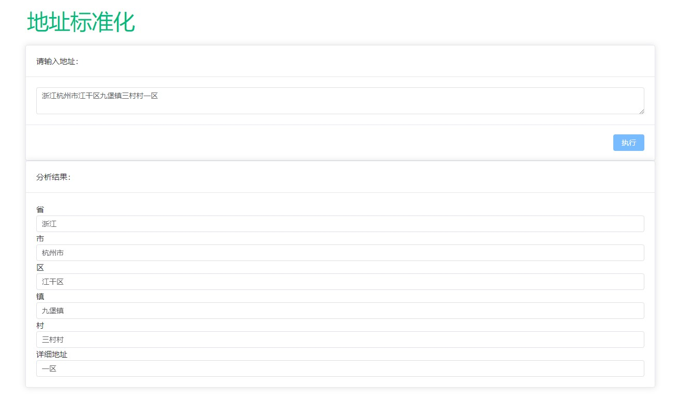

# 基于MGEO的地址标准化服务

## 技术关键词

docker、fastapi、mgeo、vue3

## MGEO介绍

将一段地址精确地转为标准格式。可以实现快递发件单自动地址识别的小功能。  
当然，这个功能可以集成到更酷炫的应用场景中。  
例如：用户口述一段地址，经过识别后，地图精准定位到目标位置。

MGEO模型地址：https://modelscope.cn/models/iic/mgeo_backbone_chinese_base/summary

## 搭建过程

使用ModelScope官方docker环境

```shell
    docker run -it -d --name mgeo -p 20002:8000 -v /D/mgeo/address-standard/src/:/root/ registry.cn-hangzhou.aliyuncs.com/modelscope-repo/modelscope:ubuntu20.04-cuda11.3.0-py37-torch1.11.0-tf1.15.5-1.6.1 /bin/sh
    # 其中/D/mgeo/address-standard/src/是我项目main.py的所在目录，可根据实际情况改写
```

容器内安装fastapi和Uvicorn

```shell
    pip install fastapi -i https://pypi.tuna.tsinghua.edu.cn/simple/
    pip install uvicorn[standard] -i https://pypi.tuna.tsinghua.edu.cn/simple/
```

容器内执行

```shell
    cd /root/
    uvicorn main:app --reload --host 0.0.0.0 --port 8000
```

启动前端

```shell
    cd  address-standard/mgeoui
    pnpm i
    pnpm dev
```

效果如图
